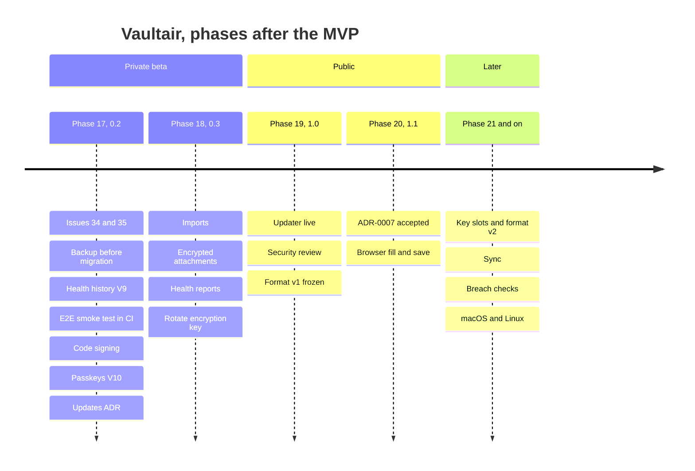
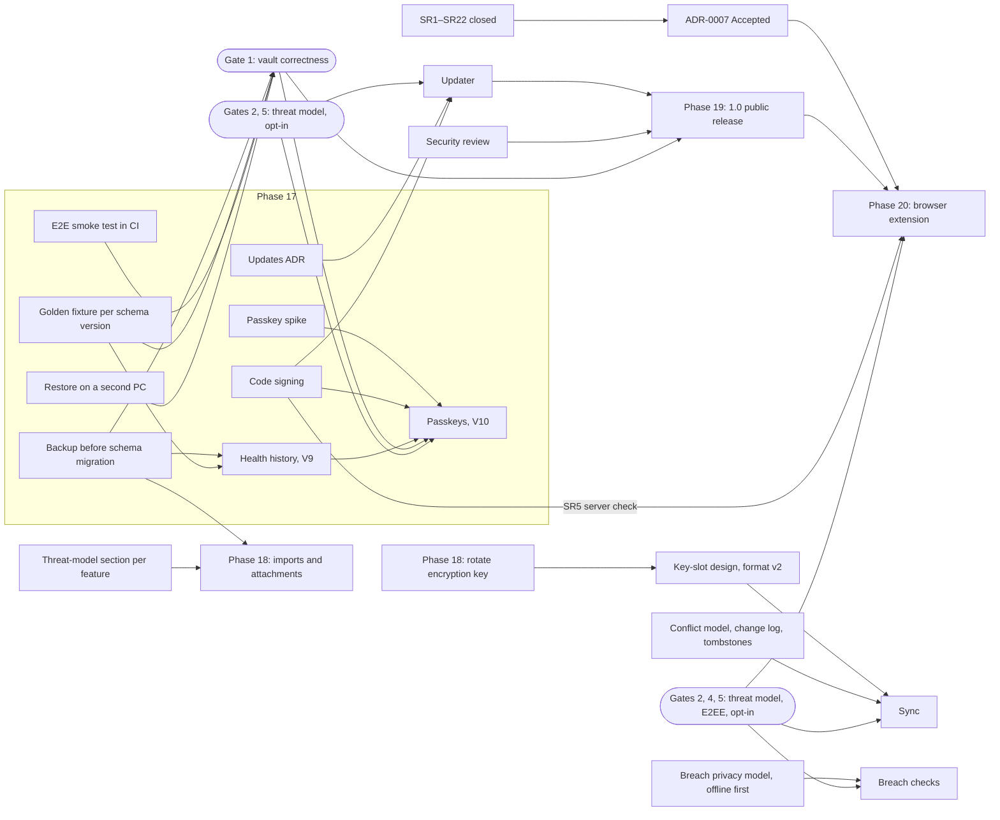
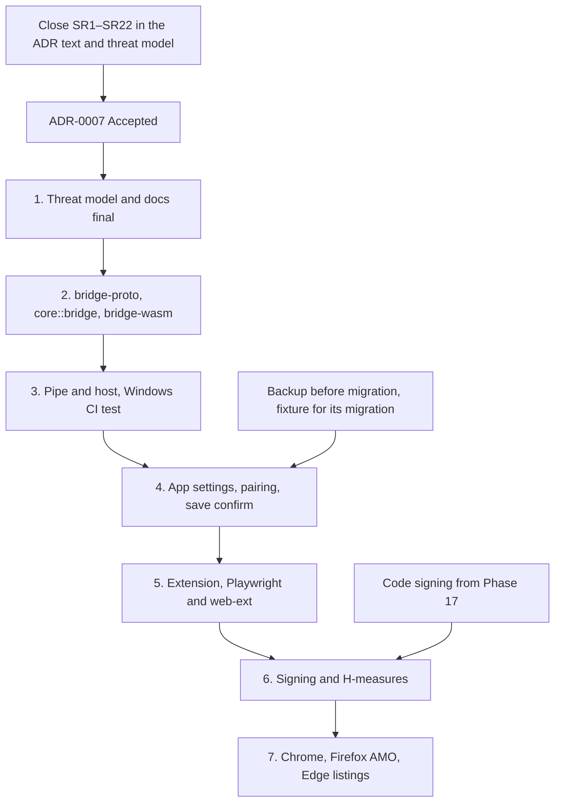
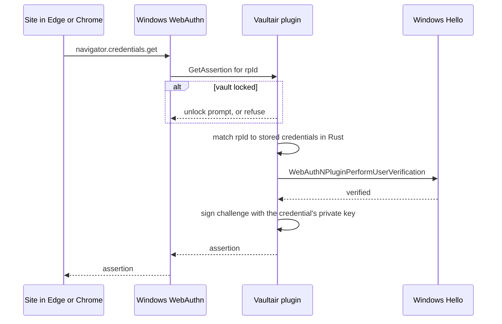
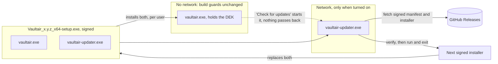

# Roadmap

> **Status:** Draft, 2026-10-09. Phases continue the numbering of the MVP plan: Phase 16 ended with the unsigned v0.1.0 beta, so the next phase is 17. Versions are the proposed order, not dates. Where this file and an ADR disagree, the ADR wins. Facts about today's state were checked against the repository on the date above; facts about Windows were checked against Microsoft's docs on the same date.

## Where things stand

- **v0.1.0** is published as an unsigned pre-release for the private beta (`docs/release.md`). There is no updater (ADR-0004 decision 15), so every build reaches testers by hand.
- **ADR-0007** (browser fill and save) is Proposed. Its security review on 2026-10-09 left 22 findings open, SR1–SR22, and that review is still going.
- **Open issues:** #40 (p1, Security Health history is never recorded), #34 (p2, backup link lands at the top of Settings), #35 (p2, duplicate Security Health quick action).
- **Not built yet, and needed before anything in `future-extension-sync-checklist.md` starts:** the automatic backup before a schema migration (no code for it exists), the end-to-end smoke test in CI (`release.md`), a recorded install on a PC without WebView2, and a recorded restore on a second PC.
- **Schema:** V1–V8 migrations. Golden fixtures (`vault-format.md` §10): `tests-fixtures/v1/Golden` (schema V1) and `tests-fixtures/v1/v0.1.0` (schema V8, with a backup), both append-only.

## Decided (2026-10-09, project owner)

- **#40 takes option A, per vault:** one row of health counts per day for the whole vault, in a new table, migration **V9**.
- **Passkeys are stored and used in Phase 17**, not only recorded. See "Passkeys" for what that pulls into the phase.
- **Updates come through a separate updater program** (option E under "Updates"), **installed by the same installer as the app** (see "Bundling"). The vault app keeps no network code.
- **The v0.1.0 beta counts as "the MVP is released"** for checklist box 1. The passkeys ADR records this; the box itself is unchanged.
- **On a PC that can't use passkeys** (Windows 10, or Windows 11 before the builds below), Vaultair keeps them and says plainly that they can't be used on this PC yet. See "Where passkeys can't be used".
- **The security review before the public release** is done by an Opus 5.5 security reviewer agent. ADR-0004's Consequences called for a third-party review when the source was closed; it has been public under GPL-3.0 since 2026-10-08. The README, `SECURITY.md` and release notes describe the review as what it is (an AI agent review, with its date and scope), not as an independent audit.

**Migration numbers:** V9 is health history, V10 is passkeys. ADR-0007 names V9 for `browser_pairing` and `browser_activity`; those take the next free number the next time the ADR is edited.

## Phases

## How the work depends on itself

Rounded boxes are gates from `future-extension-sync-checklist.md`. Nothing after a gate starts until every box in it is ticked.

### Phase 17 (v0.2): Foundations, health history, passkeys

Work in this order: the safety net, then the first migration, then passkeys.

1. **#34** (backup links open Settings at Backups) and **#35** (remove the duplicate Review health tile).
2. **Automatic backup before a schema migration** (plan §2.4, checklist box 1). Ships in the same build as V9 or earlier, never later: beta vaults are real vaults.
3. **Golden fixtures per schema version**: the current V8 fixture is kept as it is, a fixture is added for each new migration, and a test opens each.
4. **E2E smoke test in CI**: `tauri-driver` with WebdriverIO on Windows, driving `release.md` step 5, run against the release build before the draft is created.
5. **Install on a clean PC** without WebView2, and **restore a backup on a second PC**, both recorded.
6. **Health history (#40 option A, per vault).** One row per day, upserted on unlock or summary load; the last N days returned in `DashboardSummary`. The migration is tested on the V8 fixture; the gallery fixture injection is removed; `local-data-storage.md` and the privacy statement list the new table.
7. **Passkey spike, ADR and threat-model section**, then **code signing**, then **passkeys** (see "Passkeys").
8. **Updates ADR**: records option E and the bundling decision, and supersedes ADR-0004 decision 15.
9. The manual checks `security-assumptions.md` lists as not automated: hand-copy backstop in a real WebView2 window, clipboard exclusion formats, real Windows Hello.

**Done when:** a pre-release carries V9 and V10 with the pre-migration backup; gate 1's boxes are ticked with evidence; the passkeys and updates ADRs are Accepted; a passkey made on a test site with Vaultair signs in again after a lock and unlock; and the same vault opened on Windows 10 keeps its passkeys and shows the toast and warnings.

### Phase 18 (v0.3): Offline features

From the product spec's Phase 2 list, the items that need no network. Each one that reads untrusted input or writes new files needs its threat-model section first (`threat-model.md` names imports and attachments).

- **Imports**: KeePass, Bitwarden, 1Password, Enpass, CSV. A parser for files from other tools is new attack surface.
- **Encrypted attachments**, which have reserved layout space since the MVP.
- **Health reports** beyond today's five checks, and **local activity history**.
- **Custom templates** for games and platforms.
- **Rotate encryption key** (ADR-0004 decision 8, post-MVP): a new DEK and a full re-encrypt. Real revocation for any later device or extension key depends on it (checklist box 3).

**Done when:** each feature has its threat-model section, migration tests against the previous fixture, and a new golden fixture.

### Phase 19 (v1.0): Public release

- **The updater**, built to the Phase 17 ADR, signed, and installed by the same installer as the app.
- `--prerelease` removed from `release.yml`; README and `SECURITY.md` updated for signed builds. The certificate itself arrives in Phase 17 (see "Passkeys").
- **Security review** by the Opus 5.5 security reviewer, of the 1.0 build and its docs, with findings recorded and closed the way ADR-0007's are.
- `threat-model.md` out of draft (the README still calls it one).
- **Format v1 frozen**: from here golden fixtures are append-only (`vault-format.md` §10).

**Done when:** a signed installer is published as a full release, a 0.x build can reach it, and gate 1 is fully ticked.

### Phase 20 (v1.1): Browser extension

ADR-0007, in its own order of work (§Consequences), once the ADR is Accepted.

Open findings by severity, as of 2026-10-09 (the review is still running):

| Severity | Findings | Count |
|---|---|---|
| High | SR1, SR2 | 2 |
| Medium | SR3–SR10 | 8 |
| Low | SR11–SR20 | 10 |
| Info | SR21 | 1 |
| To check | SR22 | 1 |

**Done when:** the extension is in the three stores, and the docs that say "no network" and "nothing listens" read true with the bridge off and on (checklist box 5).

### Phase 21 and on

Each needs its own ADR and threat-model section.

| Item | Blocked on |
|---|---|
| Key slots, format v2 | Rotate encryption key; "too new" handling for MVP builds |
| Sync, user-controlled storage only | Key slots; conflict model with per-record versions and tombstones (checklist box 6) |
| Breach checks | Written privacy model; offline hash set considered first |
| macOS and Linux | Platform crate equivalents for Hello, DPAPI, capture protection, session events |
| Passkeys on Windows 10 and older Windows 11 | The browser extension (Phase 20) as a second way in |
| Hardware keys, mobile companion, sharing, emergency access | Spec Phase 3; cryptographic and UX design |

## Passkeys

Storing and using passkeys means Vaultair holds the private keys and signs WebAuthn challenges for sites. ADR-0007 §1 keeps passkeys out of the browser extension, so in Phase 17 the way in is Windows' own **plugin passkey manager** support.

What Microsoft documents (Plugin passkey manager support, and the `PasskeyManager` sample in Windows-classic-samples):

- **Windows 11 only:** 24H2 build 26100.6725 or later, or 25H2 build 26200.6725 or later. The README says Vaultair runs on Windows 10 and 11, so on Windows 10 and older Windows 11 builds passkeys can be stored but not used until Phase 20 adds the extension (see "Where passkeys can't be used").
- The user turns the provider on in **Settings > Accounts > Passkeys > Advanced options**, behind a Windows Hello check. Edge and Chrome then offer the provider when a site creates a passkey and in passkey autofill.
- The provider is a **COM object** registered with `WebAuthNPluginAddAuthenticator`, implementing `IPluginAuthenticator`; it confirms the user with `WebAuthNPluginPerformUserVerification` (Windows Hello). The sample declares it in a `Package.appxmanifest`, so the app has **package identity**.
- Vaultair is installed by NSIS with no package identity. Microsoft's way to give an unpackaged app one is a **package with external location**, and that package "must be signed with a certificate that is trusted on the target computer". Whether the plugin API needs identity, or only the sample uses it, is the first thing the spike checks. If it does, the code-signing certificate (ADR-0004 decision 14) moves from Phase 19 into Phase 17.

This is a new way into the app, of the kind `future-extension-sync-checklist.md` gates: today "nothing listens", and with the provider on, Windows can call Vaultair on a site's behalf. So before code:

- **Passkeys ADR.** Answers ADR-0004's "No auto-fill or auto-login, ever" for passkey sign-in, as checklist box 2 requires. Records the spike result, what is stored (credential id, rpId, user handle, private key, sign count) and where (the private key under the field envelope, like a password).
- **Threat-model section**, written and reviewed before code: the COM surface, what a site can make Windows ask for, what a locked vault answers (nothing, as checklist "Browser extension and autofill" requires), the private keys in backups.
- **Opt-in** (box 5): off until the user turns it on in Vaultair and in Windows Settings; turning it on takes the master password.
- **Gate 1 must hold first.** The checklist's box 1 starts with "The MVP is released"; the v0.1.0 beta counts (decided 2026-10-09), and the passkeys ADR says so. The other boxes in gate 1 still have to be ticked.
- **Crypto from a library**, not our own: P-256 (ES256) signing from a RustCrypto crate, added to ADR-0002's list.
- **Export and import of passkeys** (the FIDO Credential Exchange format) is out of Phase 17.

The spike, like ADR-0005's Hello spike, comes before the ADR is Accepted: register a test provider on a 24H2 build at or above 26100.6725, from an NSIS-installed exe, with and without an identity package, and sign in to webauthn.io.

### Where passkeys can't be used

On Windows 10, and on Windows 11 below the builds above, Windows has no plugin passkey support, so Vaultair can't be offered to sites as a passkey provider. Decided: the passkeys stay in the vault, and the user is told they can't be used on this PC yet.

A passkey is made by a site through the provider, and its private key can't be typed in or copied from another manager (import is out of Phase 17). So a PC like this can't add new passkeys to Vaultair; the passkeys it shows came from the same vault used on a supported PC, or from a backup restored there.

- **Toast** when a vault holding passkeys is unlocked on such a PC, once per unlock: "Your passkeys are safe in this vault, but this PC can't use them yet. Passkeys need Windows 11 24H2 or later." Toast wording and timing follow `design-system.md`.
- **Warning** in Settings next to the passkeys switch, and on each passkey in an account, saying the same. The switch is shown, turned off and disabled.
- **No other change:** the passkeys are kept, backed up and restored like any other secret, and work again when the vault is opened on a supported PC.
- **How the build is found:** the Windows build and revision numbers from the OS, checked in Rust against the minimums above, behind the platform crate's trait so tests can fake either case.
- **When it ends:** Phase 20's extension is a second way in; the message changes then.

## Updates

Chosen: **E, a separate updater program**. The vault app makes no network connections and keeps every build guard it has; the updater makes the only connection, and only when the user has turned it on.

| Option | Who makes the connection | What changes in the promise | Cost and risk |
|---|---|---|---|
| A. Manual only (today) | Nobody; the user's browser | Nothing | Users run old builds with known bugs indefinitely |
| B. Build-age notice | Nobody | Nothing | The app shows "this build is N days old" from its own build date. A nudge, not an update |
| C. winget package | `winget`, when the user runs it | Nothing in the app | A manifest per release in `microsoft/winget-pkgs`; the user still has to run `winget upgrade`. Acceptance of an unsigned installer is not checked |
| D. Tauri updater plugin in the app | The vault process | "Vaultair makes no network connections" becomes false for the app itself | Signed manifests built in. Lifts the `deny.toml` ban on the updater plugin and opens the CSP or a capability in the process that holds the DEK |
| **E. Separate updater program (chosen)** | `vaultair-updater.exe`, never the app | "The vault app makes no network connections" stays checkable | Our own code for fetch, signature check, downgrade refusal and handing over to the installer. A second binary to sign and review |
| F. Microsoft Store | The Store, for MSIX only | Nothing in the app | Tauri builds EXE and MSI only, and the Store requires those to update themselves and be code-signed, so this needs D or E anyway |

B and C need no network from Vaultair at all and can ship in Phase 17 alongside the ADR.

### Bundling

**Decided: one installer carries both programs.** A separate download would leave most people without the updater, which defeats it. Installing it isn't the same as running it: the updater does nothing until the user turns updates on, so the promise for someone who never does is unchanged.

What that means in the repository:

- **A crate of its own**, `crates/vaultair-updater`, built as a separate binary. It never depends on `vaultair-core`, so it can't open a vault, and the app never depends on it.
- **`deny.toml` changes narrowly**, as checklist box 2 asks: the one HTTP client the updater uses is allowed with `wrappers = ["vaultair-updater"]`, so the ban still fails the build if any other crate pulls it in. A CI check that `cargo tree -p vaultair` has no network crate makes the app's claim testable on its own.
- **Shipped with the app** through Tauri's `bundle.externalBin`, and started from Rust with `std::process::Command`. `tauri-plugin-shell` stays banned. `scripts/check-release-config.mjs` checks that the updater is the only external binary.
- **The installer updates both.** The updater starts the new installer and exits, so it never has to replace itself while running. Uninstalling removes both.

The ADR still has to answer:

- **Signing key.** An update key separate from the Authenticode certificate, kept offline, and what happens if either leaks. The updater checks both.
- **Downgrades.** Refuse a lower version, so an old vulnerable build can't be pushed.
- **A running app.** The installer can't replace `vaultair.exe` while it's open; the app locks and closes first, or the installer waits.
- **Vault compatibility.** A newer build migrates the vault; going back means restoring the pre-migration backup, since older builds refuse a newer vault as "too new".
- **What the server sees.** The user's IP address, the time and the current version. The privacy statement says so.
- **Opt-in and frequency.** Asked once, off by default; checks on request or on a schedule the user picks; never a silent install.
